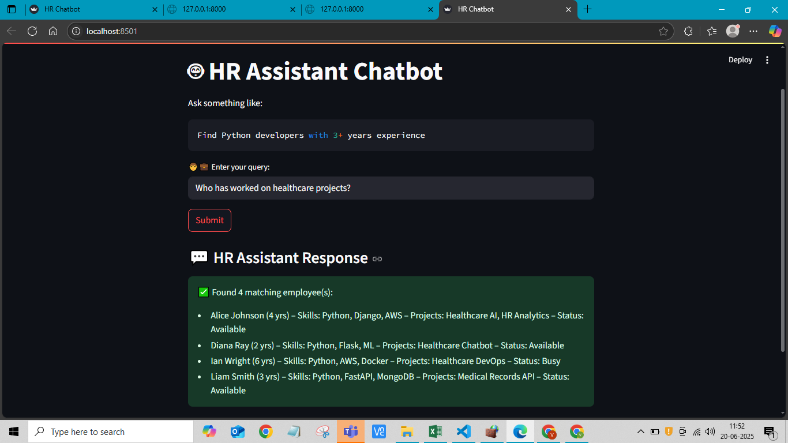
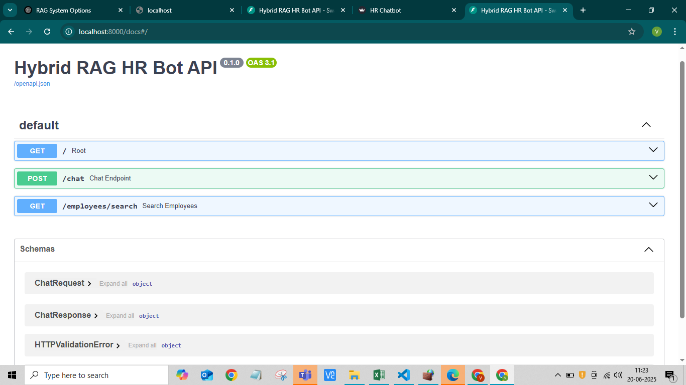
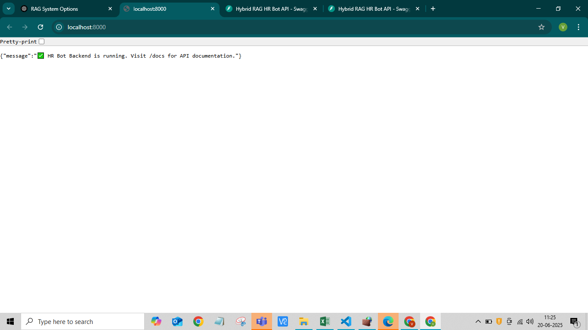

# 🤖 HR Resource Query Chatbot

## 📘 Overview

The **HR Resource Query Chatbot** is an intelligent assistant that helps HR professionals find the most suitable employees based on natural language queries. Built using a hybrid RAG (Retrieval-Augmented Generation) approach, the chatbot uses semantic search to match queries like:

> - "Find Python developers with 3+ years experience"  
> - "Suggest people for a React Native project"  
> - "Who has worked on healthcare projects?"

The system uses **FAISS + sentence-transformers** for vector-based retrieval and **template-based generation** for natural responses, making it fast, local, and API-free.

---


## 📌 Note for Reviewers / Evaluators

All required code files, screenshots of working demo (`FastAPI` and `Streamlit`), and dataset are included in this submission.

To run the application locally:

- First, start the backend API by running `app.py` with the command:
  ```bash
  uvicorn app:app --reload

This will make the FastAPI backend available at http://localhost:8000.

Then, in a separate terminal, start the frontend by running:


streamlit run frontend.py
This will launch the HR chatbot UI at http://localhost:8501.

The application is fully functional and has been tested with multiple HR queries like “Find Python developers with 3+ years experience”. You can refer to the attached screenshots for visual confirmation. No external APIs or API keys are required to run this project.


## ✅ Features

- 🔍 **Semantic Search** using MiniLM embeddings (`sentence-transformers`)
- ⚡ **FAISS vector search** for fast similarity matching
- 🔧 **Hard filter post-processing** (e.g., skill presence, experience ≥ X)
- 🧾 **Natural language response formatting** using templates (no LLM needed)
- 🌐 **FastAPI backend** with Swagger documentation
- 💬 **Streamlit-based UI** for easy HR interaction
- 📁 **Self-contained CSV dataset**
- 🧠 **AI-assisted development workflow** using ChatGPT

---

## 🏗️ Architecture

### 🔹 System Components

```plaintext
            🧑 HR User
                ↓
        Streamlit Frontend (frontend.py)
                ↓
        FastAPI Backend (app.py)
                ↓
    ┌────────────────────────────┐
    │  vector.py (RAGRetriever) │
    │  → FAISS Index + Embedding│
    └────────────────────────────┘
                ↓
        employee_dataset.csv
                ↓
        temp.py → Response Formatter


Frontend: Streamlit UI for chat interface

Backend: FastAPI endpoints to process queries and respond

Retrieval: Sentence embeddings + FAISS for similarity search

Augmentation: Hard filters (skills, experience, etc.)

Generation: Template-based, readable suggestions


## 🛠️ **Setup & Installation**

### 🔧 **Requirements**

- ✅ Python 3.8 or above  
- ✅ pip (Python package installer)  
- ✅ FastAPI  
- ✅ Uvicorn  
- ✅ Streamlit  
- ✅ SentenceTransformers  
- ✅ FAISS (CPU version)


### 📦 **Install Dependencies**

If you have a `requirements.txt` file:

```bash
pip install -r requirements.txt


▶️ Run Backend

uvicorn app:app --reload


Run Frontend

streamlit run frontend.py


**🔌 API Documentation
**✅ POST /chat
Input:

{ "query": "Find Python developers with 3+ years experience" }


Output:

{
  "response": "✅ Found 3 matching employees:\n- Alice Johnson...\n- Ian Wright..."
}


✅ GET /employees/search?skill=Python
Returns list of employees with the given skill.


🧠 AI Development Process
AI tools used:
ChatGPT (OpenAI GPT-4), used through ChatGPT Plus

AI helped with:

Generating the initial structure of FastAPI and Streamlit apps

Writing clean and reusable code for FAISS retrieval

Debugging vector shape mismatches and logic errors

Writing response templates and explanations

Designing the README content

AI-assisted code: ~70–75% of the project was AI-guided
(especially response generation, architecture planning, and embedding logic)

Manually handled:

Filtering logic (e.g., checking if 'Python' in skills)

Final formatting of chatbot answers

Manual FAISS integration testing

File uploads and debugging in local system

Interesting AI help:

ChatGPT suggested using MiniLM instead of larger models for speed

Recommended post-filtering after vector search to ensure precision

Where AI couldn’t help:

Manual validation of filters (e.g., skipping 2-year experience)

Fixing Windows Git setup issues

Local deployment and networking configuration


🧠 Technical Decisions
1. RAG Approach (Hybrid)
We used Hybrid RAG (Retrieval + Template generation) instead of full LLM-based RAG to ensure:

✅ No need for API keys (cost-free)

✅ Runs offline (fully local)

✅ Fast and explainable results

2. Open-source vs OpenAI
Chose MiniLM + FAISS instead of OpenAI to:

Avoid dependency on internet

Reduce latency and cost

Improve privacy

3. Ollama (Local LLM) vs Hybrid
Initially considered mistral via Ollama

But due to Colab + local compatibility issues and simplicity, went with template-based output

4. FastAPI vs Flask
Chose FastAPI for:

Auto-generated docs (/docs)

Type validation (Pydantic)

Cleaner, scalable backend


🔮 Future Improvements
💬 Integrate with OpenAI or Ollama for more natural LLM-generated responses

🧠 Add availability filters ("only available developers")

🖼️ Improve Streamlit UI with profile cards instead of plain text

🧪 Add unit tests for query filter logic and vector index validation

📤 Deploy on Hugging Face Spaces or Render for live public demo

📊 Admin analytics for HR teams (e.g., top searched skills)


📁 Dataset Sample


name,skills,experience_years,past_projects,availability
Alice Johnson,"['Python', 'Django']",4,"['Healthcare AI']",Available
Ian Wright,"['Python', 'AWS', 'Docker']",6,"['DevOps', 'Healthcare']",Busy
Maya Gupta,"['Python', 'NLP']",4,"['Resume Parser']",Available


## 📸 Working Demo Screenshots

### 💬 1. Streamlit Chat UI (`http://localhost:8501`)
  
*User-friendly interface where HR can type natural queries and view matching employee suggestions.*

---

### 🧪 2. FastAPI Swagger Docs (`http://localhost:8000/docs`)
  
*API testing and documentation for backend endpoints like `/chat` and `/employees/search`.*

---

### 🟢 3. Backend Root (`http://localhost:8000`)
  
*Confirms FastAPI server is running and reachable.*
